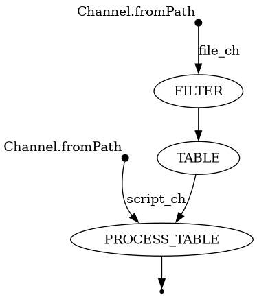

# Nextflow pipleline bcftools
## nf-natal-2025

### Arquivos
* main.nf - Aquivo de execução dos módulos.
* nextflow.config - Definição dos containers de execução e do arquivo de teste.
* table.py - Arquivo python que realização anotações nas variantes. 

**Execução dos processos** 
```
nextflow run main.nf --file HG00159.vcf
```


[Anexos do pipeline](https://drive.google.com/drive/folders/1FgwljxwUHdLBMAhdYygl3-RxAFDvBq-A?usp=drive_link)
